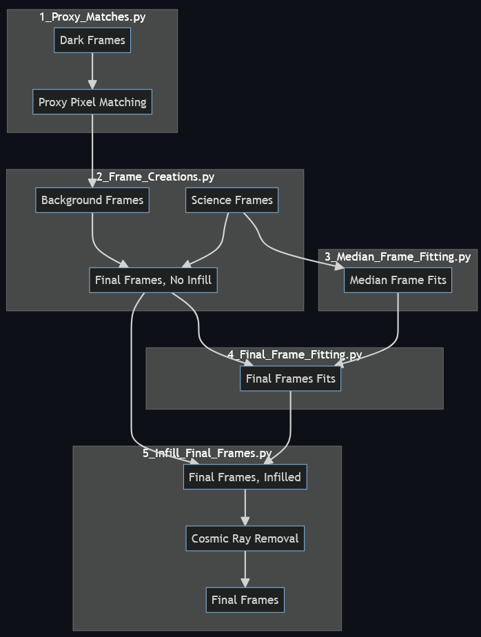
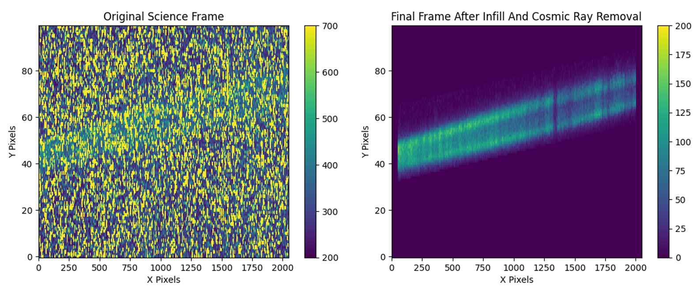

# Summary
The CUTE CubeSat mission captures near ultraviolet (NUV) spectral images from various exoplanets as it orbits Earth. These images often suffer from significant background noise due to environmental factors like detector temperature, scattered light, spacecraft jitter, etc., which can often be challenging to account for. The `CUTE CubeSat Proxy Pixel Pipeline` was developed specifically to address the challenge of background noise in the spectral images of the exoplanets observed by CUTE. 

The process involves finding "Proxy Pixel Matches" (pixels with similar behaviors across every image) to predict the behavior of the percentage of a pixel value that is noise-induced. Further polishing of the images is done by infilling the images based on certain patterns seen in the images (Gaussian Fitting) as well as eliminating the cosmic rays that infiltrate the image (done with the Python package lacosmic [@lacosmic]).  

The methodology incorporates both parallel and sequential computing techniques to optimize processing time and efficiency. The pipeline is made up of five files to facilitate debugging and there are example inputs and outputs that serve as a guide to compare the results to.

# Statement of need

The Colorado Ultraviolet Transit Experiment (CUTE) is a 6U NASA CubeSat built by the Laboratory for Atmospheric and Space Physics (LASP). Its primary mission is to observe and take images of the evolving atmospheres on short-period exoplanets for which it utilizes its Near UltraViolet (NUV) wavelength telescope. These images often suffer from significant background noise due to environmental factors like detector temperature, scattered light, spacecraft jitter, etc. [@Egan_2023]. 

Multiple attempts have been made to try and eliminate the background from the images taken by CUTE, most notably the "The Autonomous Data Reduction Pipeline for the CUTE Mission" [@Sreejith_2022]. While this pipeline has the same overall objective, the main differences between it and the pipeline being presented [INFILL HERE]

Various predictive algorithms and strategies were explored before arriving at this solution, most notably Gaussian Process Regression, and image-infilling techniques. The Gaussian Process Regression efforts proved unsuccessful due to the nature of the problem, while the image-infilling techniques provided insufficient reliability due to their neighboring pixel-based approach. The final result combines both solutions while tweaking each. 

While the CUTE CubeSat Proxy Pixel Pipeline was initially intended to process the CUTE CubeSat images, there is hope that the software proves useful to other scientific teams that have the need to eliminate background noise from their images.  

# Main Structure and Methodology
The pipeline is centered around the idea of finding Proxy Pixels in the Dark Frames to then use them to subtract the background noise from Science Frames. To continue the discussion, we present the definition of the three terms. 

- Dark Frames are images that were taken while the charged coupled device (CCD) was pointed at the void of space.

- Science Frames are the opposite of Dark Frames. These are images that were taken when the CCD was pointed at a target exoplanet to extract its spectral [INFILL HERE]. 

- Proxy Pixels are pixels that exhibit similar behavior throughout multiple pictures.

First, we find Proxy Pixel Matches by looking at the Dark Frames. Since the Dark Frames are meant to characterize and expose the general background noise of the CCD's pixels, we can use the Proxy Pixel Matches to predict the overall noise value that a pixel might have in a Science Frame. As a side note, some of the pixels are taken out of the equation due to the fact that they always show the same value (we call these "Hot Pixels"). Furthermore, since the downlinking capabilities of the CUTE CubeSat are quite limited, we are often forced to downlink ~95% of an image instead of the full image. Regardless, we create "Background Frames" by utilizing the Proxy Pixel Matches to subtract the Background Frames from the Science Frames. 

Once the background-corrected Science Frames (Final Frames) are created, there is still the issue of hot and non-downlinked pixels. To account for these empty pixels, we implement an infilling technique that takes into account the general (based on a "Median Frame") and the local (from the patterns in the Final Frames themselves) expected pixel value. 

The last step in the pipeline is to eliminate all of the cosmic rays that might have infiltrated the image as well as smooth the imperfections generated by the pipeline. This is done with the Python package lacosmic.

The flow and steps of the pipeline are shown in \autoref{fig:Flowchart}. Furthermore, the pipeline is able to return results like the one in \autoref{fig:Final Results}.

# Acknowledgements

We acknowledge contributions from Arika Egan, Kevin France, Dolon Bhattacharyya, and Sreejith Gopinathan. Their guidance and knowledge were crucial in the making of this project.

# References