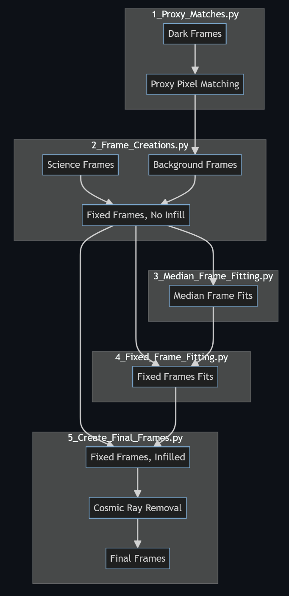
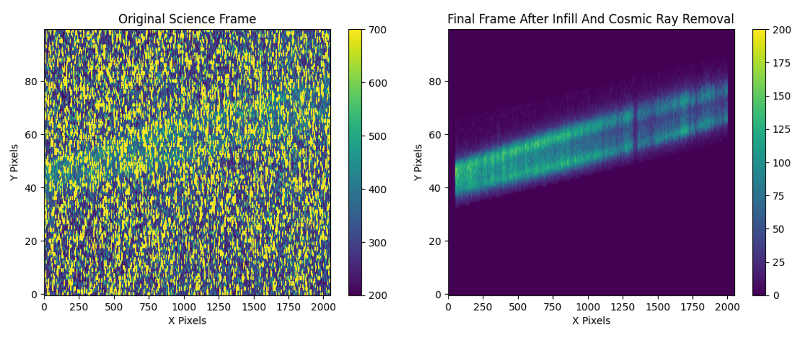

# Summary
The CUTE CubeSat mission captures near ultraviolet (NUV; 250-300 nm) spectra of transiting Hot-Jupiter type exoplanets from low Earth orbit. CUTE's data suffers from significant background noise due to environmental factors such as detector temperature, scattered light, spacecraft jitter, etc., which can often be challenging to account for. These challenges are exacerbated by the failure of CUTE's detector shutter system on-orbit.  The `CUTE CubeSat Proxy Pixel Pipeline` was developed specifically to improve the background subtraction and reduce noise in the CUTE data.

The process involves finding "Proxy Pixel Matches" (pixels with similar behaviors across every image) to predict the noise behavior of a given pixel over multiple orbits. Further image processing is done by infilling the images based on the instrumental point spread function (Gaussian Fitting), and eliminating the cosmic rays that infiltrate the image (done with the Python package lacosmic [@lacosmic]).  

The methodology incorporates both parallel and sequential computing techniques to optimize processing time and efficiency. The pipeline is made up of five scripts to facilitate debugging and there are example inputs and outputs that serve as a guide to compare the results to.

# Statement of need

The Colorado Ultraviolet Transit Experiment (CUTE) is a 6U CubeSat funded by NASA and built by the Laboratory for Atmospheric and Space Physics (LASP). Its primary mission is to observe the evolving atmospheres of short-period exoplanets, for which it utilizes its shutter-less Near UltraViolet (NUV) spectrograph that records data on a passively-cooled charge-coupled device (CCD) detector. These images often suffer from significant background noise due to environmental factors. For instance, throughout its 95-minute polar orbit, the CCD experiences temperatures ranging between -6 and -12 degrees Celsius and dark noise levels that rise and fall with the temperature; CUTE's wide field of view also subjects the CCD images to various levels of scattered light, dependent on the telescope's pointing; the spacecraft's jitter smears the spectral signal [@Egan_2023]. 

Multiple attempts have been made to correct for the background noise in the images taken by CUTE, most notably the "The Autonomous Data Reduction Pipeline for the CUTE Mission" [@Sreejith_2022]. While the pipeline presented here has the same overall objective as [@Sreejith_2022], the main difference is that this method specifically accommodates background estimation and subtraction for images affected by on-orbit failure of CUTE's shutter mechanism [@Egan_2023].

Various predictive algorithms and strategies were explored before arriving at this solution, most notably Gaussian Process Regression, and image-infilling techniques. The Gaussian Process Regression efforts proved unsuccessful since the dataset is small and the amount of removed data samples is relatively big. The image-infilling techniques provided insufficient reliability due to their neighboring pixel-based approach. The method presented here combines elements of both solutions into a new data reduction and cleaning algorithm. 

While the CUTE CubeSat Proxy Pixel Pipeline was initially intended to process the CUTE CubeSat images, the usage of this software may be easily expanded to other missions with high background noise in the science images.

# Main Structure and Methodology
The pipeline is centered around the idea of finding Proxy Pixels in the Dark Frames which can then be used to subtract the background noise from Science Frames. To continue the discussion, we present the definition of four terms. 

- Science frames have the target star centered in the spectrograph's slit producing the science spectrum; these frames are background subtracted and used to produce a light curve.

- Dark frames are obtained using a dark patch of sky slightly offset from the target star to measure the dark current and sky background.

- Proxy Pixels are pixels that exhibit similar behavior (e.g. dark noise) over multiple orbits.

- Spectral Pixels are pixels over which the spectral trace lies in the Science Frames.

First, we find Proxy Pixel Matches for every Spectral Pixel with a non-Spectral Pixel in Dark Frames. These non-Spectral Pixels have values in the Science frames that are not superimposed with any spectral signal, so we consider this the pure noise of the Science Frame. A Spectral Pixel will have its non-Spectral Proxy Pixel's Science Frame value subtracted out from it. This effectively subtracts out the background noise (assuming the similarity of noise properties of the background level between Dark and Science Frames). As a side note, some of the pixels are taken out of the equation due to the fact that they always show the same value (i.e., "Hot Pixels"). Furthermore, since the downlinking capabilities of the CUTE CubeSat are limited, we are often forced to downlink ~95% of an image instead of the full image. Regardless, we create "Background Frames" by utilizing the Proxy Pixel Matches to subtract the Background Frames from the Science Frames. 

Once the background-corrected Science Frames (Fixed Frames) are created, there is still the issue of hot and non-downlinked pixels. To account for these empty pixels, we implement an infilling technique that takes into account the general (based on a "Median Frame") and the local (from the patterns in the corresponding Fixed Frames themselves) expected pixel value. 

The last step in the pipeline is to eliminate all of the cosmic rays that might have infiltrated the image (creating the Final Frames), as well as smooth the imperfections generated by the pipeline. This is done with the Python package lacosmic.

The flow and steps of the pipeline are shown in \autoref{fig:Flowchart}. Furthermore, the pipeline is able to return results like the one in \autoref{fig:Final Results}.

# Acknowledgements

CUTE was developed and operated with the support of two NASA/APRA awards to the Laboratory for Atmospheric and Space Physics at the University of Colorado Boulder, NNX17AI84G and 80NSSC21K1667.

# References