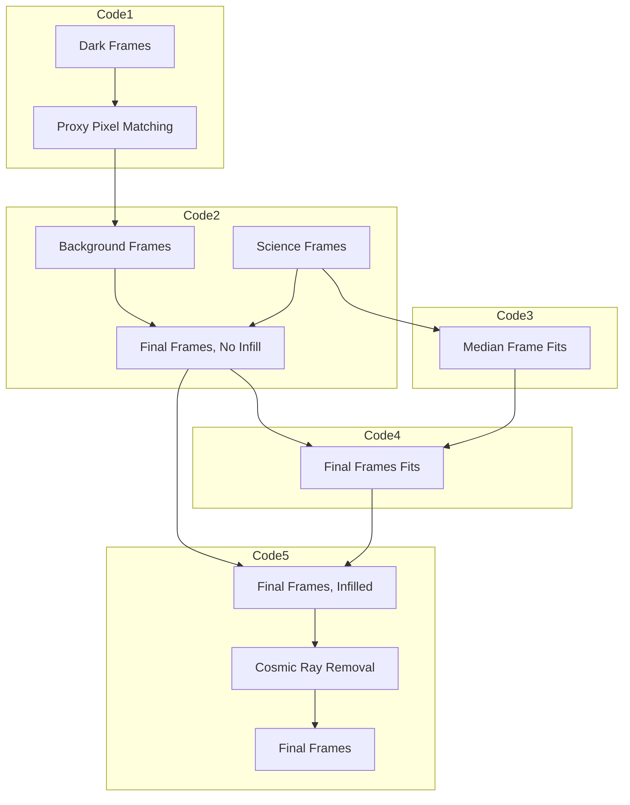

# Proxy Pixel Pipeline
The Proxy Pixel Pipeline is an image-processing pipeline developed by Sebastian Escobar and the Colorado Ultraviolet Transit Experiment (CUTE) Team. This pipeline focuses on the image background reduction of the spectral images taken by the CUTE CubeSat with the purpose of extracting the spectral signal of the observed exoplanet.

The pipeline turns an image like the one on the left, to one that looks like the one on the right.

<p align="center">
  
</p>

# Table of Contents

- [Overview](#Overview)
- [Instructions](#Instructions)
- [Proxy Pixel Matching](#proxy-pixel-matching)
  + [Pixel Types](#Pixel-Types)
  + [Proxy Pixel Matching Methods](#Proxy-Pixel-Matching-Methods)
    + [Median Method](#Median-Method)
    + [LSQ Method](#LSQ-Method)
- [Frames Creation](#Frames-Creation)
- [Median Frame Gaussian Fitting](#Median-Frame-Gaussian-Fitting)
- [Final Frames Gaussian Fitting](#Final-Frames-Gaussian-Fitting)
- [Infill Final Frames](#Infill-Final-Frames)

# Overview

To understand our problem, consider this analogy:

> Say you took pictures of a really faint object (we call these `Science Frame`s). However, these images have a lot of noise due to multiple factors like scattered light, the temperature of the camera, etc., meaning that the actual brightness of the object is being misrepresented. To get rid of the background noise in the images and discover the true brightness of the object, because you are really smart, you decide to take some pictures with that same camera inside a pitch-dark room (we call these `Dark Frame`s) to see if you can use this information to then clean up your bright object image.

To connect the terminology used in the example to the actual use case:

- Bright Object = A bright star
- Science Frames = Stills of an exoplanet orbiting the bright star
- Dark Frames = Stills of an arbitrary, dark location in the night sky

To tackle this issue, we created this pipeline which is composed of 5 steps:
1. [Proxy Pixel Matching](#proxy-pixel-matching) (Code 1)
   - We find behavioral patterns within pixels
2. [Frames Creations](#Frames-Creation) (Code 2)
   - Given the patterns in the pixels, we create a Background Frame and then subtract it from the Science Frame, giving the resulting Final Frames
3. [Median Frame Gaussian Fitting](#Median-Frame-Gaussian-Fitting) (Code 3)
   - We created a Median Frame from the Science Frames and fit multiple Gauss curve fits to its columns
4. [Final Frames Gaussian Fitting](#Final-Frames-Gaussian-Fitting) (Code 4)
   - Given the Final Frames, we fit multiple Gauss curve fits to their columns with the help of the Median Frame Fits
5. [Infill Final Frames](#Infill-Final-Frames) (Code 5)
   - We use the Final Frame fits to infill the Final Frames and we then remove the cosmic rays using lacosmic  

See below for a comprehensive flowchart that shows which steps are included in which code files.


# Instructions

To simplify the pipeline and make it easier to debug, the pipeline consists of 5 files. Each file corresponds to one of the steps mentioned in the [Overview](#Overview) section.


To run the first code, enter the following line in the command window (this assumes that you have setup the MPI4PY HELP python library):

```
mpiexec -n 4 py .\1_Proxy_Matches.py
```

To run the second code, enter the following in the command window:

```
mpiexec -n 4 py .\2_Frames.py
```

> [!NOTE]
> n is the number of processors you want to run the code with. The higher the number of processors, the faster the code will run.


# Proxy Pixel Matching
The basis of this pipeline is to eliminate the background noise in every spectral image taken of an exoplanet mid-transit. To do this, we employ a pattern-finding technique that we call `Proxy Pixel Matching` to eliminate the background noise based on the expected noise value of certain pixels.

Proxy Pixel Matching is the process in which we look at a pixel's behavior throughout multiple pictures and determine if its behavior is similar to another pixel's. Once we find a pixel whose behavior is similar to another pixel's, we determine these two pixels to be 'proxy' of each other, thus forming a proxy pixel match. By finding a proxy pixel match, we can confidently say that the behavior of both pixels is the same, and replace one of the pixel's values with its proxy match and vice-versa.

## Pixel Types
This pipeline was developed for the images produced by the CUTE CubeSat. For this reason, we decided to separate all of the pixels in the charge-coupled device (CCD) into two categories:

- Spectral Pixels
- Non-Spectral Pixels

As the name suggests, spectral pixels are the ones that are spatially located in the CCD exactly where the spectral signal falls. Opposite to those, are the non-spectral pixels which are simply the ones that are not located where the spectral signal is. The figure below shows the spectral and non-spectral pixels in a sample image.

<p align="center">
  
</p>

Given that the expected value of spectral pixels is higher than that of the non-spectral pixels, finding a proxy pixel match between them is highly improbable *in Science Frames*. For this reason, we decided to find proxy pixel matches using Dark Frames. This way, we can `use all of the Dark Frames to find proxy pixel matches between spectral and non-spectral pixels, with the goal of having a match for every single spectral pixel`. 

Below is a comprehensive image that explains what a proxy pixel match looks like. Notice how every spectral pixel in the image has a proxy non-spectral pixel.

<p align="center">
  
</p>

## Proxy Pixel Matching Methods
There are two ways we can determine a proxy pixel match:

- Median Method
- LSQ Method

### Median Method
When using the median method, we perform a two-step search. We first get the residuals between a single spectral pixel and all of the non-spectral pixels. Then, we:

- Parse through these residuals and pick the residuals that have a median value closest to zero
- Within those residuals, pick the residual with the smallest standard deviation

This way `a proxy pixel match is 'made' between the spectral and non-spectral pixel whose residual's median is closest to zero and whose residual's standard deviation is the smallest`. We repeat this process until every spectral pixel has a proxy non-spectral pixel.

Below is a graph that shows two proxy pixels, one spectral and the other non-spectral, and their values across all the Dark Frames as well as their residuals after using the Median Method.


<p align="center">
  
</p>

<p align="center">
  
</p>

<p align="center">
  
</p>

### LSQ Method
The LSQ Method stands for 'Least Squares Method'. When using this method, we first take the residuals between a single spectral pixel and all of the non-spectral pixels. Then, we square every value in the residuals array and then sum all of the numbers. This way every comparison made between spectral and non-spectral pixels will have its own 'LSQ' value. We then normalize all of the LSQ values based on the number of values used when comparing the pixels and pick the comparison with the smallest normalized LSQ value.

> [!NOTE]
> The Proxy_Matches.py file has the Median Method as a default. However, the LSQ Method is commented out in lines HELP if you decide to use this method.  

# Frames Creation
Since the Dark Frames are stills of an arbitrary point in the night sky, we can confidently say that every pixel's value is mostly influenced by the noise of the CCD and other factors. We often call the values in the Dark Frames, 'dark noise values'. Thus, by finding the proxy pixel matches in the dark frames, we can say that the dark noise of pixel A is the same or similar to pixel B. Since our goal is to eliminate the underlying noise in the Science Frames, we create a `Background Frame` that can then be subtracted from the Science Frame. To create a Background Frame, we:

1. Create an empty canvas with the same shape as a Science Frame
2. To fill in the Background Frame, consider a single proxy pixel match. We take the non-spectral pixel value of the proxy match in a Science Frame and then place its value in the position of the spectral pixel in the Background Frame. Then repeat this until every single spectral pixel in the Background Frame has its proxy pixel value in it.

Since the non-spectral pixels in a Science Frame have no spectral signal in them, their value is ideally the same when compared to it in a Dark Frame. We create the Background Frame this way so that the underlying dark noise value of the spectral pixel (which is the value of its non-spectral pixel proxy match), can be subtracted from the spectral pixel value in the Science Frame. The final result is called the `Final Frame`.

Below is a comprehensive image that showcases the logic behind the Background Frames and Final Frames creation.

<p align="center">
  
</p>

Below is what an actual Science, Dark, Background, and Final Frame look like.

<p align="center">
  
</p>

<p align="center">
  
</p>

<p align="center">
  
</p>

<p align="center">
  
</p>

The reason for the empty pixels (the white pixels in the actual images) is due to the fact that we excluded hot pixels and unavailable pixels from the proxy pixel matching algorithm. Hot pixels are described as pixels that have an abnormally high value throughout every single frame. An unavailable pixel is usually due to a poor frame downlink in which the pixel value was never obtained. 

## Median Frame Gaussian Fitting
While the Final Frames exist, there is still the issue of the empty pixels that needs to be dealt with. To fix this, we decided to create a `Median Frame` from which we could extract some information to infill the Final Frames. The Median Frame was created by taking the median pixel value of every pixel throughout all the Science Frames. Below is what a Median Frame looks like.   

<p align="center">
  
</p>

We can see that the Median Frame has a much more noticeable gradient compared to the actual Science Frames. Furthermore, after taking into consideration the cross-dispersion profile of the CUTE science data, we decided to take a look at the pixel values across a column of the Median Frame. When we did that, we noticed the clear Gaussian distribution in the column traces of the Median Frame. 

Given this column-wise Gaussian distribution pattern, we decided to use this information to give a value to the empty pixels in the Final Frames. To make the calculations simpler and faster, we chose to group the columns into 'bins'. This way, each 'bin of columns' would contain a specific number of columns from which the Gaussian distributions would be created (we got the median of each pixel value between all the columns in a bin). After getting the Gaussian distribution for every bin of columns, we fit a Gaussian to it. Below is what all of the columns in a bin look like compared to the median curve that is then used to fit the double Gaussian.

> [!NOTE]
> The Gaussian distribution turns into two Gaussian distributions as columns are sampled from left to right in the image. This is due to the de-focus that was experienced between pre-flight and on-orbit testing (Egan et al. 20203).

<p align="center">
  
</p>

Below is a gif that shows what the Median Frame Fits look like for every bin of columns. 

<p align="center">
  
</p>

While, in practice, this should be enough to infill those empty pixels, we decided to be even more precise with the infilling process.

## Final Frames Gaussian Fitting

Having completed the Median Frame Fits, we decided to take a look at the Final Frames and see if this Gaussian distribution pattern is still there; And surely enough, this pattern is still there in the Final Frames. With this information, we thought it was best to not discard the Median Frames Fits, but instead use them to influence the creation of the `Final Frame Fits`. This was done to try to account for time-and-spatial dependent factors that might be missing in the Median Frame. 

We forced the fits of the Final Frames to have the ratio of the two peaks be the same as the Median Frame Fits for every bin of columns. Everything else is the same as the corresponding bin of columns from the Median Frame.

Below is what the Final Frame Fits look like.

<p align="center">
  
</p>

At this point of the pipeline, it was a good time to stop and use the Final Frame Fits to infill the Final Frames.

> [!NOTE]
> The reason we decided to include 25 columns per bin in the code is because this binning provides sufficient spectral resolution to achieve CUTE's primary science objectives of isolating individual spectral features.

## Infill Final Frames

With the help of the Final Frame Fits, it was easy to determine which pixel value corresponded to which in the Final Frames. Since every Final Frame has a specific Final Frame Fit, we looked at the x and y positions of the pixels and grabbed the values from the specific final frame fits that corresponded to those pixels. 

We decided to infill all of the pixels that had a pixel value lower than 0 (due to an outlier proxy pixel value or an over-subtraction that occurred in the Final Frame creation process) and that were empty (due to poor downlinking). Below is what a Final Frame looks like after being infilled.

<p align="center">
  
</p>

We can see how much better the Final Frames look like after this infill. However, there was an underlying issue that was apparent in all of the Final Frames: cosmic rays.

So far, the pipeline had not concerned itself with cosmic rays. However, now that we had a Final Frame with a value for every pixel, we could take care of the cosmic rays in the image. To do this, we decided to use the lacosmic python library (HELP link to lacosmic). This algorithm not only cleared the image of any cosmic rays, but it also got rid of any possible outliers the pipeline might have caused. For this reason, this step was the last step of the pipeline, giving Final Frames that look like the one below. 

<p align="center">
  
</p>


END


> Methodology
>
> Before you begin, you look at the Dark and Science Frames and notice some imperfections in the frames which will come into play later on:
> 
> - Non-existent pixel values in some images (due to a poor transfer of data when downlinking the image)
> - Hot pixels (due to the age of the camera, these pixel values are consistently irrationally high)
> 
> To eliminate the background noise and unveil the true brightness of your object, you use the Dark Frames you took to find patterns in the pixels' behavior. Once you find a pattern `Proxy Pixel Match`, you build a `Background Frame` that contains the expected noise value of every pixel. However, given the imperfections in the frames, you decide to eliminate some of the pixels out of the background frame since those values would be either too high or non-existent. You then **subtract the Background Frame from the Science Frame**, creating a `Final Frame`.
>
> Now, you have to deal with all of the pixels that you eliminated from the background frame. To do this, you decide to create a median frame that has all of the median pixel values of all your Science Frames. Then, you realize that there is a double Gaussian curve pattern from top to bottom in your images and decide to fit a curve to it, creating the `Median Frame Fits`. This _could_ be used to replace (infill) the empty pixel values in your final frames. However, you decide to go the extra mile and see if this pattern exists in the final frames (avoiding the empty pixel values). When you try this out, you realize that the pattern is there, except the curves are just not quite the same. So, you choose to take the median frame fits into account when creating the `Final Frame Fits`. The idea is that you can use the final frame fits to infill the pixel values in the final frame knowing the location of every pixel that needs to be infilled.
>
> So, you do exactly that. You use the final frame fits (which were created by grabbing a top-to-bottom strip of the final frame) to infill the final frame. You now have a final frame that has a value for every pixel. However, you now realize that your final frame has some magical cosmic rays in the image which look like really bright streaks. Luckily, someone already had this happen to them and they developed a `Cosmic Ray Removal` code that fixes this. So, you use their code to clean up your image of cosmic rays, giving you the Final Frame (this time it is actually the final frame).
>
> 
